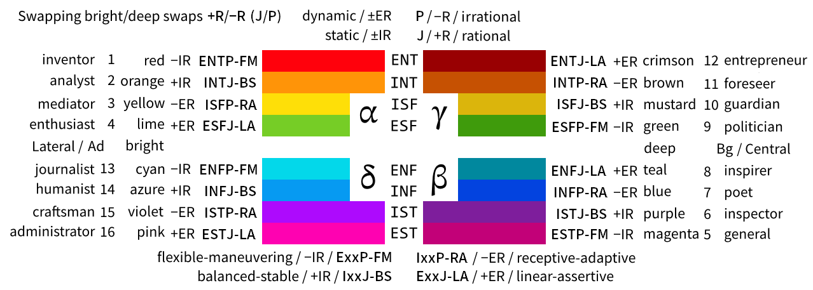

# Alternative translation of Jung-Augustinavichiute-Talanov Socionics to English + On incompatibility of Socionics and MBTI

This is an alternative translation of the basic concepts of one of the braches of Socionics to English. My vision of the ***Jung-Augustinavichiute-Talanov Socionics*** (**JATS**). My vision doesn't cover some interesting parts of JATS (like metrics; see chapter 10 for details in discussions) and sometimes it goes beyond JATS. Sometimes only main terms were translated and described so this article is full of stubs. See Summary for notables.

## Contents

* [Summary](#summary)
* [1. Jung-Augustinavichiute-Talanov cognitive functions](#1-jung-augustinavichiute-talanov-cognitive-functions)
* [2. Aspects as basis in classical Socionics vs. JAT cognitive functions as a basis in JATS](#2-aspects-as-basis-in-classical-socionics-vs-jat-cognitive-functions-as-a-basis-in-jats)
* [3. Types in classical Socionics vs. reference types in JATS](#3-types-in-classical-socionics-vs-reference-types-in-jats)
* [4. Socionics reference types names vs. MBTI types names](#4-socionics-reference-types-names-vs-mbti-types-names)
  - [4.1 Gulenko's Temperaments translated](#41-gulenkos-temperaments-translated)
  - [4.2 Type names matching table](#42-type-names-matching-table)
* [5. Revised Gulenko's names for types. 1-16 numbers as names for types with mnemonics](#5-revised-gulenkos-names-for-types-1-16-numbers-as-names-for-types-with-mnemonics)
* [6. On dichotomies, MBTI incompatibility, Big Five](#6-on-dichotomies-mbti-incompatibility-big-five)
* [7. Model A](#7-model-a)
* [8. Quadras and functions. Why quadras grouped this way? Central vs. Lateral types](#8-quadras-and-functions-why-quadras-grouped-this-way-central-vs-lateral-types)
  - [8.1 Interactive table of intertype relationships](#81-interactive-table-of-intertype-relationships)
* [9. Intermediate and unknown types names](#9-intermediate-and-unknown-types-names)
* [10. Further reading and notable discussions](#10-further-reading-and-notable-discussions)
* [11. Symmetries of Reinin dichotomies and their connection to Khizhnyak functions and axes](#11-symmetries-of-reinin-dichotomies-and-their-connection-to-khizhnyak-functions-and-axes)
  - [11.1 Reinin dichotomies](#111-reinin-dichotomies)
  - [11.2 Khizhnyak functions and axes](#112-khizhnyak-functions-and-axes)
    - [11.2.1 8 Abstracted Khizhnyak axes](#1121-8-abstracted-khizhnyak-axes)
  - [11.3 8 Reinin-Khizhnyak axes as a basis for 12 Khizhnyak axes](#113-8-reinin-khizhnyak-axes-as-a-basis-for-12-khizhnyak-axes)
    - [11.3.1 Seven Complementary Reinin-Khizhnyak axes](#1131-seven-complementary-reinin-khizhnyak-axes)
  - [11.4 Non-standard dominant Khizhnyak functions](#114-non-standard-dominant-khizhnyak-functions)
  - [11.5 Dominant-agnostic type names](#115-dominant-agnostic-type-names)
  - [11.6 Dynamic-static axis as a measure of Khizhnyak functions differentiation](#116-dynamic-static-axis-as-a-measure-of-khizhnyak-functions-differentiation)
  - [11.7 Model A analogue stub with Gulenko's temperaments and Khizhnyak functions](#117-model-a-analogue-stub-with-gulenkos-temperaments-and-khizhnyak-functions)
  - [11.8 FZA1: Hypothesis for 7 axes of independent variation in factorized traits space](#118-fza1-hypothesis-for-7-axes-of-independent-variation-in-factorized-traits-space)
  - [11.9 Bright/deep rainbow colors to plot 16 probability density functions on a single image](#119-brightdeep-rainbow-colors-to-plot-16-probability-density-functions-on-a-single-image)

## Summary

1. The short **descriptions of JAT cognitive functions** that are consistent (I hope) with JATS are given. These descriptions are sometimes different from understanding of cognitive functions in other branches of Socionics.
2. Standard MBTI acronyms for Jung cognitive functions (**Se, Si, Ne, Ni, Fe, Fi, Te, Ti**) and original dichotomies (**E/I, N/S, T/F**) are used for MBTI partial compatibility purpose (**P/J** was dropped). Dichotomies that are measured by tests are compatible enough in Socionics, MBTI and Big Five to be called the same term (good **infographics on Big Five** is given here: [psychologycharts.com/big-five-personality-traits.html](http://www.psychologycharts.com/big-five-personality-traits.html)). Congnitive functions deviate more but not enough to deserve a separate name. Standard Socionics functions symbols (● ○ ▲ △ ◆ ◇ ■ □) and Victor Gulenko’s 8 latin letters (F, S, I, T, E, R, P, L) were abandoned as inconvenient, unpopular in English community or weird.
3. All cognitive functions are called **kinds of perceprion** and **kinds of judging**. “**Sensory perceprion**” is used instead of Sensing/Sensorics, “**Intuitive perceprion**” is used instead of Intuition, “**Task-oriented judging**” is used instead of Thinking/Logic, “**Feelings-oriented judging**” is used instead of Feeling/Ethics. I also like HBDI approach [en.wikipedia.org/wiki/Herrmann_Brain_Dominance_Instrument](https://en.wikipedia.org/wiki/Herrmann_Brain_Dominance_Instrument) that calls all them the kinds of thinking.
4. Single-noun terms like **intuiter, sensor, feeler and tasker** are used (also **perceiver** and **judger**).
5. **Rational/Irrational** (**+R/−R**) names were used instead of **Judging/Perceiving** to make Socionics vs. MBTI contradictions more clear.
6. The **contradictions between MBTI and Socionics** are made explicit so the type conversion isn’t possible for introverts. Proposed new explicit Socionics types names help to achieve this too: **INT+ir** (INT/ir, LII) vs. **INT−er** (INT/&#x2060;-&#x2060;er, ILI) those are dominant introverted tasker & rational intuiter vs. dominant introverted intuiter & irrational tasker
7. Very basic introduction to quadras is given and discussed **why quadras grouped this way**. Alpha-Delta vs. Beta-Gamma types are translated as **Lateral** vs. **Central** types (**−C/+C**). The link to the autotranslated **interactive table of intertype relationships** with descriptions is provided.
8. Concise names for **intermediate and unknown types** were proposed. The names extend MBTI types names. **1-16 numbers as names** for reference types were proposed for unknown and mixed types notation and speech (+ mnemonics). Examples: **\*NT(+ad)**, **\~NT(+ad)** that are unknown and mixed types from ENT−ir (ENTP) and INT+ir (LII).
9. Some differences between **types** in classical Socionics and **reference types** in Jung-Augustinavichiute-Talanov Socionics are outlined. Some differences between **information aspects** in classical socionics and Jung-Augustinavichiute-Talanov **cognitive functions** are outlined.
10. Revised **Gulenko's names** for types were proposed (both translations and **names** were revised). **Inventor** for ENT−ir (ENTP), Enthusiast for ESF+er (ESFJ), General for EST−ir (ESTP), Poet for INF−er (IEI), **Inspirer** for ENF+er (ENFJ), **Foreseer** for INT−er (ILI), Entrepreneur for ENT+er (ENTJ), **Journalist** for ENF−ir (ENFP).
11. The set of hypotheses about Jung-Augustinavichiute-Talanov (JAT) cognitive functions is given. Together hypotheses give **Model A** as consequences. Bonus: **Cognitive functions descriptions per position in Model A (8x8 auto-translated table)**.
12. Unambiguous translation of Model A was proposed: 1-Dominant, 2-Supporting, 3-Role, 4-Vulnerable, 5-Suggestive, 6-Activating, 7-Restrictive, 8-Background. **Ambiguity because of the Model G** was described.
13. Further reading: [The framework of the typology of Jung-Augustinavichyute (Socionics Framework)](https://translate.google.ru/translate?hl=ru&sl=ru&tl=en&u=https%3A%2F%2Fgithub.com%2Fkiwi0fruit%2Fmisc%2Ftree%2Fmaster%2Fsrc%2Fsocionics-rus).
14. **Symmetries of Reinin dichotomies and their connection to Khizhnyak functions and axes were given**. See Contenst section for details.
15. **Notable discussions**: [reddit.com/r/JungianTypology/comments/b5pase](https://www.reddit.com/r/JungianTypology/comments/b5pase/model_a_as_consequence_of_a_set_of_hypotheses/), [reddit.com/r/JungianTypology/comments/b12uju](https://www.reddit.com/r/JungianTypology/comments/b12uju/translation_of_some_useful_socionics_terms/).

## 1. Jung-Augustinavichiute-Talanov cognitive functions

But there are some differences between definitions of **cognitive functions** in MBTI and in *Jung-Augustinavichiute-Talanov Socionics* (JATS). Actually my understanding of Talanov's ideas is a outdated. **JAT cognitive functions** roughly speaking are the ways of perception and judging (thinking):

- Additional **function attitude**:
    - [**Introverted** functions (**I**)] Introverted, passed through oneself, passive, restoring, energy saving functions vs.
    - [**Extraverted** functions (**E**)] Extraverted, directed outwards, active, energy-consuming functions.
- [**Irrational** functions (**−R**)] Perceiving, instinctive, impulsive functions:
    - [**Intuitive** perception (**N**, i**N**tuitive)] Abstract, imaginative, assumptive, associative thinking / perception (breadth of associations) vs.
    - [**Sensory** perception (**S**)] Tangible-oriented, detailed, concrete, materially-oriented thinking / perception (orientation to physical reality and physical qualities).
- [**Rational** functions (**+R**)] Judging, stable, impulse controlling functions (decision-making):
    - [**Task-oriented** judging (**T**)] Logical, analytical, algorithmic, task-oriented thinking, reasoning (orientation to formal side and facs) vs.
    - [**Feelings-oriented** judging (**F**)] Moral, empathic, sentimental, social-oriented, interpersonal emotional thinking (feelings, emotional regulation of society).

- **Ne** - _Extraverted intuitive perception_. Conjectures, guesses and speculations (e.g. about the essence), ideas, curiosity, novelty seeking.
- **Ni** - _Introverted intuitive perception_. Fantasy, fictional reality, imagining processes in time, prognostication, prediction, forecasting
- **Se** - _Extraverted sensory perception_. Active actions, confrontation, the accumulation of material resources, aggression, strength.
- **Si** - _Introverted sensory perception_. Health, comfort, convenience, safety. Perception of sensations. Some people claim that aestetics of various perceptions is in Si domain.
- **Te** - _Extraverted task-oriented judging_. Actions and their algorithms, tools, pattern action-result (formal part of activities organizing).
- **Ti** - _Introverted task-oriented judging_. Order, laws, structures, classification, analysis and comparison.
- **Fe** - _Extraverted feelings-oriented judging_. Modifying the mood and the emotional state of people hence manipulating their activities (e.g. by means of inspiration and enthusiasm). Modifying group activity is specifically important.
- **Fi** - _Introverted feelings-oriented judging_. Moral judgment and evaluation, building relationships, synchronization of attitude towards something in a group of people, morality.

Another useful section of the functions is:

- [*Dynamic* functions] Ni, Si, Te, Fe vs.
- [*Static* functions] Ne, Se, Ti, Fi (see [Model A chapter](#7-model-a) on conscious vs. semiconscious functions for more details).

Mind that extraverted and introverted functions are specializations on top of their "general" basic functions. For example both strong Se and Si are good at dealing with physical qualities. Both strong Ne and Ni are good at dealing with associations.

## 2. Aspects as basis in classical Socionics vs. JAT cognitive functions as a basis in JATS

Unlike classical Socionics, in which the basic concept is the aspect of information, the basic concept in JATS is the reference type. In my vision the reference types are characterized by the properties of their Jung cognitive functions. So the basic concepts are actually the Jung cognitive functions which in turn are characterized by the yet unknown neurophysiological mechanisms in the brain and a person’s life experience.

Thus, the ***information aspect*** is something that JAT ***cognitive function uses*** and ***pays attention to***. And the information metabolism is merely interactions between different cognitive functions of the individual or interactions of any cognitive functions of different persons (but it’s easier to track down interactions of the same cognitive functions when we investigate interactions between people).

## 3. Types in classical Socionics vs. reference types in JATS

There are 16 reference types in Jung-Augustinavichiute-Talanov Socionics (JATS) that is one of the branches of Socionics. JATS is actually more like a trait model (like Big Five) not a type theory. *Victor Talanov himself isn’t affiliated with this article as his publications are in Russian language only*. But this article summarises some of his ideas.

***Each particular person does not belong to the one of reference types*** in JATS. But instead the similarity between the person and all 16 reference types is evaluated (using questionnaire). So we move from determining of the person’s type to the measuring Jung cognitive functions using similarity to reference types. This procedure is described in more details in works of Talanov [sociotoday.narod.ru/index1.html](http://sociotoday.narod.ru/index1.html)

This approach is also useful in determining of 1-3 closest reference types without questionnaire (using observations only). In this case the reference types are simply socionics types weighted with degrees of likeness. And even in this case the properties of Jung cognitive functions can be roughly determined using the Model A and weighted averaging of functions properties for all reference types found.

## 4. Socionics reference types names vs. MBTI types names

In my translation of Socionics types names to English 3 letter code shows the position on 3 axes I/E, S/N, F/T. And then Gulenko's temperament using I/E and +R/−R (that is equivalent to J/P). Axes can be measured by MBTI or Big Five tests (where MBTI J/P axis measures roughly the same as big Five conscientiousness). MBTI does not have counterpart types for introverts. For example the closest counterpart for INT+ir is INTx that is one of two types INTJ/INTP (or their mixture).

### 4.1 Gulenko's Temperaments translated

In works of Victor Talanov types are groped by Quadras (see section 8.) and temperaments of Victor Gulenko.

Gulenko's Temperaments:

* E/&#x2060;-&#x2060;IR - flexible-maneuvering, Ir**R**ational-**E**xtraverted-static. Are characterized by impulsive and unpredictable behavior,
* I/IR - balanced-stable, **R**ational-**I**ntroverted-static. Are characterized by slow and methodical behavior,
* I/&#x2060;-&#x2060;ER - receptive-adaptive, Ir**R**ational-**I**ntroverted-dynamic. Are characterized by lack of motivation, inertia, and unstable moods and energy levels,
* E/ER - linear-assertive, **R**ational-**E**xtraverted-dynamic. Are characterized by energetic and proactive behavior.

Note that first E/I letter is redundant as it only helps to read faster -&#x2060;IR, IR, -&#x2060;ER, ER are enough to encode all 4 temperaments.

It can also be speculated that temperaments can be classified according to +R/−R and I/E traits:

* E/&#x2060;-&#x2060;IR - spontaneous proactivity,
* I/IR - rigid reactivity,
* I/&#x2060;-&#x2060;ER - spontaneous reactivity aka adaptivity,
* E/ER - rigid proactivity.

These temperaments can be used for [dominant agnostic type names](#115-dominant-agnostic-type-names) (which are given in the the next 4.2 section too).

### 4.2 Type names matching table

Names are in the following order:

- **Socionics reference type No.1**, **Socionics reference type No.2**, **Number name**,
- Socionics type name literal translation, MBTI name, [reddit.com/r/JungianTypology](https://www.reddit.com/r/JungianTypology/) name.

| quadra  |                   E/&#x2060;-&#x2060;IR                    |                      I/IR                       |                   I/&#x2060;-&#x2060;ER                    |                      E/ER                       |
|:------- |:----------------------------------------------------------:|:-----------------------------------------------:|:----------------------------------------------------------:|:-----------------------------------------------:|
| α Alpha | **ENT/&#x2060;-&#x2060;ir**  **ENT−ir**  **1**  |    **INT/ir**  **INT+ir**  **2**     | **ISF/&#x2060;-&#x2060;er**  **ISF−er**  **3**  |    **ESF/er**  **ESF+er**  **4**     |
|         |                       ILE  ENTP  NeT                       |                 LII  INTx  TiN                  |                       SEI  ISFx  SiF                       |                 ESE  ESFJ  FeS                  |
|         |     dominant extraverted intuiter & irrational tasker      | dominant introverted tasker & rational intuiter |      dominant introverted sensor & irrational feeler       |  dominant extraverted feeler & rational sensor  |
| β Beta  | **EST/&#x2060;-&#x2060;ir**  **EST−ir**  **5**  |    **IST/ir**  **IST+ir**  **6**     | **INF/&#x2060;-&#x2060;er**  **INF−er**  **7**  |    **ENF/er**  **ENF+er**  **8**     |
|         |                       SLE  ESTP  SeT                       |                 LSI  ISTx  TiS                  |                       IEI  INFx  NiF                       |                 EIE  ENFJ  FeN                  |
|         |      dominant extraverted sensor & irrational tasker       |  dominant introverted tasker & rational sensor  |     dominant introverted intuiter & irrational feeler      | dominant extraverted feeler & rational intuiter |
| γ Gamma | **ESF/&#x2060;-&#x2060;ir**  **ESF−ir**  **9**  |    **ISF/ir**  **ISF+ir**  **10**    | **INT/&#x2060;-&#x2060;er**  **INT−er**  **11** |    **ENT/er**  **ENT+er**  **12**    |
|         |                       SEE  ESFP  SeF                       |                 ESI  ISFx  FiS                  |                       ILI  INTx  NiT                       |                 LIE  ENTJ  TeN                  |
|         |      dominant extraverted sensor & irrational feeler       |  dominant introverted feeler & rational sensor  |     dominant introverted intuiter & irrational tasker      | dominant extraverted tasker & rational intuiter |
| δ Delta | **ENF/&#x2060;-&#x2060;ir**  **ENF−ir**  **13** |    **INF/ir**  **INF+ir**  **14**    | **IST/&#x2060;-&#x2060;er**  **IST−er**  **15** |    **EST/er**  **EST+er**  **16**    |
|         |                       IEE  ENFP  NeF                       |                 EII  INFx  FiN                  |                       SLI  ISTx  SiT                       |                 LSE  ESTJ  TeS                  |
|         |     dominant extraverted intuiter & irrational feeler      | dominant introverted feeler & rational intuiter |      dominant introverted sensor & irrational tasker       |  dominant extraverted tasker & rational sensor  |

Note that first E/I letter is redundant as it only helps to read faster −ir, +ir, −er, +er are enough to encode all 4 temperaments.

For example INT+ir is *intuitive task-oriented rational introvert with dominant Ti* or *dominant introverted tasker & rational intuiter*.

- **N** - intuitive, intuiter,
- **S** - sensory, sensor,
- **T** - task-oriented, tasker,
- **F** - feelings-oriented, feeler,
- **E** - extraverted, extravert,
- **I** - introverted, introvert.
- **−R** - irrational,
- **+R** - rational,

Though I'm not fond of using neither feelers nor tentacles. Neither sensors nor detectors. My favourite is "sensing feelers" 🐙.

### 5. Revised Gulenko's names for types. 1-16 numbers as names for types with mnemonics

Both translations and names were revised. Lytov's translation of Gulenko's names is the main translation used now.

|  ID | JATS¹             | Mnemonic               | Revised Gulenko's | Literal Gulenko (Gulenko-Lytov), Keirsey³ (Keirsey-1984²) |
| ---:| ----------------- | ---------------------- | ----------------- |:---------------------------------------------------------:|
|   1 | ENT−ir | The very first curious | **Inventor**      |                     Seeker, Inventor                      |
|   2 | INT+ir | The second one curious | Analyst           |              Analyst, Mastermind (Scientist)              |
|   3 | ISF−er | Three Musketeers Dumas | Mediator          |                Mediator, Composer (Artist)                |
|   4 | ESF+er | Four elements          | **Enthusiast**    |         Enthusiast (Bonvivant), Provider (Seller)         |
|   5 | EST−ir | The five senses        | **General**       |               Marshal (Commander), Promoter               |
|   6 | IST+ir | Has no sixth sense     | Inspector         |              Inspector, Inspector (Trustee)               |
|   7 | INF−er | Seven Sins / Wonders   | **Poet**          |                Lyricist, Healer (Questor)                 |
|   8 | ENF+er | Eight-bit              | **Inspirer**      |                Mentor, Teacher (Pedagogue)                |
|   9 | ESF−ir | Nine lives of a cat    | Politician        |            Politician, Performer (Entertainer)            |
|  10 | ISF+ir | Proper as a dozen      | Guardian          |             Guardian, Protector (Conservator)             |
|  11 | INT−er | 11 football players    | **Foreseer**      |                     Critic, Architect                     |
|  12 | ENT+er | 12 hours, dozen        | **Entrepreneur**  |         Entrepreneur (Enterpriser), Fieldmarshal          |
|  13 | ENF−ir | Devil's/Baker's dozen  | **Journalist**    |   Advise-giver (Psychologist), Champion\* (Journalist)    |
|  14 | INF+ir | Twice sinful as 7 type | Humanist          |               Humanist, Counselor (Author)                |
|  15 | IST−er | Finishes the job too   | Craftsman         |               Craftsman, Crafter (Artisan)                |
|  16 | EST+er | Finishes the job       | Administrator     |         Administrator, Supervisor (Administrator)         |

¹JATS - Jung-Augustinavichiute-Talanov Socionics,  
² David Keirsey, Marilyn Bates, *Please understand Me, Character and Temperament Types*, 1984,  
²,³ Mind that Keirsey names are given as a matter of reference as conversion between Socionics and MBTI introverts is not possible (see the next chapter),  
\* - champion is in a sense of a proponent.

Names mapping between Socionics and Keirsey is done by traits axes instead of cognitive functions stack as it's the only scientifically backed part of Jungian typologies. Rational behaviour is mapped with Judging behaviour, Irrational behaviour is mapped with Perceiving behaviour. See how good introverts aling:

* **Analyst**, Mastermind (**Scientist**),
* Inspector, Inspector (Trustee),
* Guardian, Protector (Conservator),
* Craftsman, Crafter (Artisan),

That indirectly supports the assumption that MBTI-Socionics mapping should be done by traits axes instead of cognitive functions stack.

## 6. On dichotomies, MBTI incompatibility, Big Five

***Important*** thing to note is that

*   If the reference type’s dominant function is extraverted then the behaviour of the reference type is also more extraverted than introverted (and vice versa).
*   If the reference type’s dominant function is irrational then the behaviour of the reference type is also more perceiving than judging (and vice versa).
*   If the reference type’s dominant function is one of the intuitive thinking functions then the behaviour of the reference type is also more intuitive than tangible-oriented and sensory (and vice versa).
*   If the reference type’s dominant function is one of the task-oriented thinking functions then the behaviour of the reference type is also more task-oriented than feelings-oriented (and vice versa).

This leads to the possibility of defining I/E, P/J, S/N, F/T dichotomies and obtaining correlations with Big Five personality model [en.wikipedia.org/wiki/Myers–Briggs_Type_Indicator#Big_Five](https://en.wikipedia.org/wiki/Myers%E2%80%93Briggs_Type_Indicator#Big_Five). In that study the MBTI ***dichotomies*** used are somewhere ___about the same___ as in Socionics. But at the same time the hypothesis about the internal structure of type’s ***Jung cognitive functions properties*** are ___different___ in MBTI and Socionics / JATS.

Good infographics on Big Five (that have close relations with socioncs and MBTI) is given here: [psychologycharts.com/big-five-personality-traits.html](http://www.psychologycharts.com/big-five-personality-traits.html). There are also some other good names and connections.

It’s worth mentioning that the Socionics hypothesis of correlations between dichotomies and Jung cognitive functions are expected to be statistical or visible only in the most vivid cases of persons. For example: if we see the highly introverted (I) and highly self-disciplined (+R aka J) person then what Jung congnitive function he would expect they has as dominant function? Socionics says that it would be Ti or Fi MBTI says it would be Ni or Si But in many particular cases of people there can be combinations of “Ti dominant and more like irrational-perceiving behavior” or “Ni dominant and more like rational-judging behaviour”. But in most cases Socionics expects “Ti dominant and more like rational-judging behavior”. This even can be experimentally verified by tests that measure Jung cognitive functions and dichotomies independently.

So if we are talking about type of particular person not about reference types then using I/E and +R/−R (J/P) dichotomies can be misleading or inaccurate. So the noting person’s dominant function is a better option. For example: Ne dom., Ti dom. Auxiliary function also worth noting but Socionics research shown that for example in case of Ne dom. and task-oriented thinking (T) both Te (8) and Ti (2) may play importaint role in assisting dominant Ne So they both can be viewed as auxiliary function as Jung meant it (actually Jung didn’t say whether auxilary function for Ne dom. is Ti or Te). There need to be more invesigations on this topic but for now it’s more accurate to think that the auxilary function is just T, F, S or N withount specifying whether it is Te or Ti, etc.

***Explicit notation*** for Socionics types are **INT+ir** and **INT−er**. **+R**/**−R** in Socionics mean the same as **J**/**P** in MBTI and Big Five (high/low conscientiousness). Same is for E/I, N/S, T/F. And the first cognitive function is a dominant function as Jung meant it. The rule is simple: judging type has a judging dominant function (perceiving type -> perceiving dominant function). Introverted type has an introverted dominant function (extraverted type -> extraverted dominant function). And this notation explicitly reminds about it.

## 7. Model A

*Note that this description is not affiliated with Talanov's Socionics.*

There are *at least* three widespread models of conginitive functions: Model A, Model G and MBTI model.

* Model A functions names differ from author to author to the point where both 4-Vulnerable and 6-Activating functions can be called *Mobilizing* by different authors.
* Model G that is popular on [reddit.com/r/JungianTypology](https://www.reddit.com/r/JungianTypology) makes the situation even worse as it calls 2-Supporting function *5-Demonstrative* and calls 8-Background function *2-Creative*.
* MBTI *Auxiliary* function name is ambiguous as there are still [debates](https://www.reddit.com/r/JungianTypology/comments/fvuo27/model_a_translations_became_ambiguous_because_of/fmo7miq/) which attitude Jung meant for auxiliary function (extraverted or introverted). For example Wikipedia article about [cognitive functions](https://en.wikipedia.org/wiki/Jungian_cognitive_functions#Carl_Jung) doesn't specify attitude for Jung's functions model.

So in my translation of Model A I wanted to fix possible misunderstandings:

* I use **1-Dominant** as there is no point to change Jung's term in English.
* I use new **2-Supporting** name. *Creative* became ambiguous because of the Model G. *Auxiliary* is ambiguous because Jung wasn't clear enough. This function name should be something like **Conscious auxiliary** if we are to expand Jung terms.
* **3-Role** and **4-Vulnerable** are the most widespread Model A translations and are not ambiguous.
* **5-Suggestive** is the most widespread Model A translation and is not ambiguous. It's also better than _suggesti_**ble**. As _suggest_**ive** better aligns with **Autonomous inferior** as Jung meant this function.
* **6-Activating** is better than ambiguous *mobilizing* and it is the most widespread in the auto-translated texts.
* I simply like **7-Restrictive** more than alternatives (it also better than *restricting*).
* **8-Background** is better than *demonstrative* which became ambiguous because of the Model G. And *background* better aligns with it's meaning of **Automatic auxiliary**.

| Functions        |                  | Strength | Consciousness             | Value        |    Example | ENT−ir |
| ---------------- | ---------------- | -------- | ------------------------- | ------------ | ----------:|:----------------- |
| ***1 Dominant*** | 2 Supporting     | strong   | conscious                 | valuable     | ***1 Ne*** | 2 Ti              |
| 4 Vulnerable     | ***3 Role***     | weak     | conscious                 | not valuable |       4 Fi | ***3 Se***        |
| *5 Suggestive*   | **6 Activating** | weak     | semiconscious (automatic) | valuable     |     *5 Si* | **6 Fe**          |
| **8 Background** | *7 Restrictive*  | strong   | semiconscious (automatic) | not valuable |   **8 Te** | *7 Ni*            |
| **proverted: 1,3,6,8**; antiverted: 2,4,5,7; *pronal: 1,3,5,7*; antinal: 2,4,6,8\* | | 1 > 8 > 2&7 > 3 > 6 > 5 > 4; **strong proverted** > **strong antiverted**; **weak proverted** > **weak antiverted** | | 1>2; 5>6; 4>3; 8>7; **valuable pronal** (1,5) set long-term life goals | | |

\* names were derived from rational-irrational and extraverted-introverted.

**NEW: [Cognitive functions descriptions per position in Model A (8x8 auto-translated table)](https://translate.google.ru/translate?hl=ru&sl=ru&tl=en&u=https%3A%2F%2Fkiwi0fruit.tumblr.com%2Ffunctions&sandbox=1)**.

* **pronal** vs. **antinal** functions (names derived from rational-irrational):
  * [*italic*]  functions are **pronal** functions: 1, 3, 5, 7.  
    For rational types that's rational functions. For irrational types that's irrational functions,
  * [not italic] functions are **antinal** functions: 2, 4, 6, 8.  
    For rational types that's irrational functions. For irrational types that's rational functions,
  * 1 and 5 functions set long-term life goals of a person, and 2 and 6 do not. This give rise to a hypothesis that 3 and 7 functions can be superior to 4 and 8 functions in context of goals. But that's a speculation only.
* **proverted** vs. **antiverted** functions (names derived from extraverted-introverted):
  * [**bold**] functions (or having the same index as dominant function) are **proverted** functions: 1, 3, 6, 8.  
    For extraverts that's extraverted functions. For introverts that's introverted functions,
  * [not bold] functions (or having different index to dominant function) are **antiverted** functions: 2, 4, 5, 7.  
    For introverts that's extraverted functions. For extraverts that's introverted functions.
  * **strong proverted** functions are stronger than **strong antiverted** functions,
  * **weak proverted** functions are stronger than **weak antiverted** functions.
* *italic* and **bold** can be **_combined_**.
* **strong** vs. **weak** functions:
  * Strong functions think and solve their tasks competently, efficiently, confidently, quickly, easily. In contrast, weak functions tend to be less competent, work slowly, uncertainly, and require much more effort. [There is an opinion](http://socionica74.narod.ru/about4.html) that strong functions are more robust, i.e. able to work longer at the same level of quality without overexertion, and that strong functions are “resistant to interference,” that is, they are able to ignore distracting and interfering factors in their work, to work effectively in spite of them. Weak functions are not durable and not resistant to interference. It is best to compare the functions of one person.
* **conscious** vs. **semiconscious (automatic)** functions:
  * Conscious functions are characterized by the fact that the overwhelming majority of the time type reflects and ponders using these functions. Well aware of such thoughts and reflections. The work of automatic functions happens most of the time as if by itself. These functions regularly work as if automatically, notice something, process something and provide the result of their work to conscious functions, but the process of their work is not in the focus of attention. If you ask to consciously think with the help of automatic functions, the consciousness will try to get away from this activity, go to thinking with the help of conscious functions.
  * All conscious functions are either static or dynamic (hence semiconscious functions would be either dynamic or static accordingly).
* **valuable** vs. **not valuable** functions:
  * The work of valuable functions and its nuances are important for the type, they are interesting, type can listen and talk on these topics with pleasure. Valuable functions provide an active exchange of information between people, what is associated with the work of these functions is easily discussed. The work of not valuable functions is what the type considers in life not the most important, something that can be neglected, something that makes sense only as an addition to valuable functions. As a rule, the discussion of the work of these functions is not interesting and does not give pleasure (but there are exceptions), it is preferred to help each other without further ado. The type in most cases limits the activity of the not valuable functions to the needs of valuable ones (that mostly 1st and 2nd functions), the demands of society or circumstances.
* Additional info on Model A can be found in [Wikipedia](https://en.wikipedia.org/wiki/Socionics#Model_A).

|       | **E/&#x2060;-&#x2060;IR** |            |     | **I/IR**              |            |     | **I/&#x2060;-&#x2060;ER** |            |     | **E/ER**              |            |
| ----- |:------------------------- |:---------- | --- |:--------------------- |:---------- | --- |:------------------------- |:---------- | --- |:--------------------- |:---------- |
| **α** | **ENT−ir**     | **1**      |     | **INT+ir** | **2**      |     | **ISF−er**     | **3**      |     | **ESF+er** | **4**      |
|       | ***1 Ne***                | 2 Ti       |     | ***1 Ti***            | 2 Ne       |     | ***1 Si***                | 2 Fe       |     | ***1 Fe***            | 2 Si       |
|       | 4 Fi                      | ***3 Se*** |     | 4 Se                  | ***3 Fi*** |     | 4 Te                      | ***3 Ni*** |     | 4 Ni                  | ***3 Te*** |
|       | *5 Si*                    | **6 Fe**   |     | *5 Fe*                | **6 Si**   |     | *5 Ne*                    | **6 Ti**   |     | *5 Ti*                | **6 Ne**   |
|       | **8 Te**                  | *7 Ni*     |     | **8 Ni**              | *7 Te*     |     | **8 Fi**                  | *7 Se*     |     | **8 Se**              | *7 Fi*     |
|       |                           |            |     |                       |            |     |                           |            |     |                       |            |
| **β** | **EST−ir**     | **5**      |     | **IST+ir** | **6**      |     | **INF−er**     | **7**      |     | **ENF+er** | **8**      |
|       | ***1 Se***                | 2 Ti       |     | ***1 Ti***            | 2 Se       |     | ***1 Ni***                | 2 Fe       |     | ***1 Fe***            | 2 Ni       |
|       | 4 Fi                      | ***3 Ne*** |     | 4 Ne                  | ***3 Fi*** |     | 4 Te                      | ***3 Si*** |     | 4 Si                  | ***3 Te*** |
|       | *5 Ni*                    | **6 Fe**   |     | *5 Fe*                | **6 Ni**   |     | *5 Se*                    | **6 Ti**   |     | *5 Ti*                | **6 Se**   |
|       | **8 Te**                  | *7 Si*     |     | **8 Si**              | *7 Te*     |     | **8 Fi**                  | *7 Ne*     |     | **8 Ne**              | *7 Fi*     |
|       |                           |            |     |                       |            |     |                           |            |     |                       |            |
| **γ** | **ESF−ir**     | **9**      |     | **ISF+ir** | **10**     |     | **INT−er**     | **11**     |     | **ENT+er** | **12**     |
|       | ***1 Se***                | 2 Fi       |     | ***1 Fi***            | 2 Se       |     | ***1 Ni***                | 2 Te       |     | ***1 Te***            | 2 Ni       |
|       | 4 Ti                      | ***3 Ne*** |     | 4 Ne                  | ***3 Ti*** |     | 4 Fe                      | ***3 Si*** |     | 4 Si                  | ***3 Fe*** |
|       | *5 Ni*                    | **6 Te**   |     | *5 Te*                | **6 Ni**   |     | *5 Se*                    | **6 Fi**   |     | *5 Fi*                | **6 Se**   |
|       | **8 Fe**                  | *7 Si*     |     | **8 Si**              | *7 Fe*     |     | **8 Ti**                  | *7 Ne*     |     | **8 Ne**              | *7 Ti*     |
|       |                           |            |     |                       |            |     |                           |            |     |                       |            |
| **δ** | **ENF−ir**     | **13**     |     | **INF+ir** | **14**     |     | **IST−er**     | **15**     |     | **EST+er** | **16**     |
|       | ***1 Ne***                | 2 Fi       |     | ***1 Fi***            | 2 Ne       |     | ***1 Si***                | 2 Te       |     | ***1 Te***            | 2 Si       |
|       | 4 Ti                      | ***3 Se*** |     | 4 Se                  | ***3 Ti*** |     | 4 Fe                      | ***3 Ni*** |     | 4 Ni                  | ***3 Fe*** |
|       | *5 Si*                    | **6 Te**   |     | *5 Te*                | **6 Si**   |     | *5 Ne*                    | **6 Fi**   |     | *5 Fi*                | **6 Ne**   |
|       | **8 Fe**                  | *7 Ni*     |     | **8 Ni**              | *7 Fe*     |     | **8 Ti**                  | *7 Se*     |     | **8 Se**              | *7 Ti*     |

### Model A decomposition

A set of hypotheses about Jung-Augustinavichiute-Talanov (JAT) cognitive functions that together give Model A as consequences is given below. Decomposition to separate hypotheses gave rise to a pair of new assumptions.

#### Set of hypotheses:

* **H1 [8-cognitive-functions]** We can allocate 8 JAT cognitive functions in the human psyche. They are defined descriptively by researchers as the basis for observations. See [Section 1](#1-jung-augustinavichiute-talanov-cognitive-functions) for details.
* **H2 [strong-weak]** There are strong and weak functions. Either Ne and Ni are strong and Se and Si are weak or Se and Si are strong and Ne and Ni are weak. Independently either Te and Ti are strong and Fe and Fi are weak or Fe and Fi are strong and Te and Ti are weak.
* **H3 [dominant]** There is a dominant “first” function that stands out and becomes the strongest and the main “conductor of the orchestra”.
* **H4 [PeJi-PiJe]** Functions form pairs to think well-consciously about something (the most productive way of thinking). That's pairs of opposite functions: extraverted + introverted, judging + perceiving (just like 1st and 2nd functions pair).
* **H5 [PeJe-PiJi]** Functions also form pairs when one function support another (that is they together perform some task but one of them acts only as support for solving the task of another function). But in this case it's not like that well-conscious thinking in H4. It's pairs of same-verted (extravert + extravert or introvert + introvert) but judging + perceiving functions (just like 1st and 8th functions pair).
* **H6 [most-inferior]** Weak function that is pronal but antiverted to dominant function (perceiving if 1st is perceiving, judging if 1st is judging, extraverted if 1st is introverted, introverted if 1st is extraverted) becomes the most inferior function (to the point of not controlling it so it has its own motivation and becomes valuable function). That's the 5th function.
* **H7 [EI]** Extraversion is a general property of a person manifested in the fact that extroverted functions are stronger than their introverted counterparts (Ne is stronger than Ni; Se > Si; Te > Ti; Fe > Fi). Similarly for introversion (Ni > Ne; Si > Se; Ti > Te; Fi > Fe). This is not just the dominance of the 1st function and the manifestation of its properties by type most clearly and vividly. This attitude is of a general nature, i.e. it affects all functions of the type. The state of immersion in oneself for an introvert is more natural than the state of immersion in the external world (for an extrovert it's the opposite). And if some state is more natural then it is easier for a person. It happens more often and manifests itself brighter and stronger
* **H8 [PJ]** Judging or Perceiving is a general property of a person manifested in the choice between greater control of behavior with focusing on stability and planning or preferring improvisation, impulsive behavior and spontaneity.
* **H9 [auxilary]** There are two same-named auxilary functions (“2nd” and “8th”) that stand out as the dominant function assistants (they are the second in strength after the dominant). Same named means they are both intuitive or both sensory or both task-oriented or both feelings-oriented.
* **H10 [IE>JP]** H7 [EI] has stronger effects than H8 [PJ]. That means that:
  * **strong proverted** functions are stronger than **strong antiverted** functions,
  * **weak proverted** functions are stronger than **weak antiverted** functions.

#### Hypothesis consequences:

* **C8 [strength]** H3 [dominant], H9 [auxilary], H2 [strong-weak] →  
  1-Dominant and 2-8-auxiliary functions are strong hence 1, 2, 7, 8 are strong functions and 3, 4, 5, 6 are weak functions.
* **C9 [consciousness]** H3 [dominant], H4 [PeJi-PiJe], H5 [PeJe-PiJi], H6 [most-inferior] →  
  1-Dominant is conscious (H3) hence 3-Role is also conscious because it's of the same nature (same IE and JP). 1-2 and 1-4 are conscious assistance pairs (H4). 1-8 and 1-6 are automatic assistance pairs (H5). 5-Suggestive is automatic (H6). And 1st being conscious and 5th being automatic somehow lead to 7th also being automatic. Hence 1, 2, 3, 4 are conscious functions and 5, 6, 7, 8 are automatic functions.
* **C1 [12-valuable-34-not;1>2]** H3 [dominant], H9 [auxilary], H2 [strong-weak], H4 [PeJi-PiJe] →  
  1, 2 are valuable functions (H3, H9), 3, 4 are not valuable functions (1-2 pair shadows 3-4 pair) because they cannot help 1st function via H4. 3rd would clash with 1st and 4th would be useless for 1st when 2nd is much more useful. This also means that 1 is more valued than 2 (H3),
* **С2 [more-valued:4>3]** H3 [dominant], H4 [PeJi-PiJe], C1 [12-valuable-34-not;1>2] →  
  4 is move valued than 3 because 1-4 pair is a subject of H4 [PeJi-PiJe]. But they both are still not valuable.
* **C3 [78-not-valuable]** H3 [dominant], H9 [auxilary], H2 [strong-weak], H4 [PeJi-PiJe], H5 [PeJe-PiJi] →  
  7 and 8 functions are not valuable (7, 8 functions only assist 1, 2 strong functions that work in mental pair).
* **С4 [more-valued:8>7]** H3 [dominant], H5 [PeJe-PiJi], C3 [78-not-valuable] →  
  8 function is more valued than 7 function because 1-8 pair is a suject of the H5 [PeJe-PiJi] hence 8 is useful for dominant fucntion. But they both are still not valuable.
* **С5 [56-valuable;5>6]** H6 [most-inferior] →  
  means that 5 is a valuable function. I guess this somehow leads to 6 also being valuable function. This also means that 5 is more valued than 6 (somehow).
* **С6 [proverted-antiverted]** H2 [strong-weak], H3 [dominant], H7 [EI], H10 [IE>JP] →  
  puts additional constraints to functions strengths. H7 [EI]: 1>7; 8>2; 3>5; 6>4; H2 [strong-weak]: 1,2,7,8 > 3,4,5,6; H3 [dominant]: 1>8; H10 [IE>JP]: 1>2; 8>7; 3>4; 6>5 where “>” means “stronger”.
* **С7 [pronal-antinal]** H3 [dominant], H6 [most-inferior], H8 [PJ], С5 [56-valuable] →  
  1 and 5 functions set long-term life goals of a person, and 2 and 6 do not. This give rise to a hypothesis that 3 and 7 functions can be superior to 4 and 8 functions in context of goals. But that's a speculation only.

## 8. Quadras and functions. Why quadras grouped this way? Central vs. Lateral types

Socionics **quadras** split 16 types to 4 groups. Each group has **E/&#x2060;-&#x2060;IR** type with a dominant extraverted irrational-perceiving function, **I/IR** type with a dominant introverted rational-judging function, **E/ER** type with a dominant extraverted rational-judging function and **I/&#x2060;-&#x2060;ER** type with a dominant introverted irrational-perceiving function.

Dominant function in Socionics is called **1st** function. And Socionics splits Jung's auxilary function to **2nd** function and **8th** function. If the 1st function is extraverted then the 2nd is introverted and the 8th is extraverted. And vice versa. In case of INT+ir it would be 1Ti2Ne8Ni 1st, 2nd and 8th functions are the most important from the point of view of the type's social activities (and are the reference type's strongest functions). And may be also they are the most important from the point of view of the type’s self-identification. 2nd and 8th functions both are like auxilary function as Jung meant it. But only 1st and 2nd are valuable functions.

#### Why quadras grouped this way?

Let's explain this in the example of the delta quadra.

Deltas are: ENF−ir, INF+ir, EST+er, IST−er. So as commonly believed in MBTI xNFP and xSTJ are not delta. As believed in Socionics:

* ENF−ir has dominant Ne, supporting Fi, and Si as the most inferior function (to the point of dominant function not controlling it so it has its own motivation and becomes valuable function) - _autonomous inferior_ function aka _suggestive_ function,
* INF+ir has dominant Fi, supporting Ne, and suggestive Te,
* EST+er has dominant Te, supporting Si, and suggestive Fi,
* IST−er has dominant Si, supporting Te, and suggestive Ne

Hence deltas are \*NF/±ir and \*ST/±er. Or \*NF(+ad) and \*ST(+ad) - see below.

So the functions the type values most are 1-dominant, 2-supporting and 5-suggestive. For some reason in Socionics believed that commonly ENF−ir also values Te, INF+ir also values Si, EST+er also values Ne, IST−er also values Fi (6-activating).

So this can be seen that these 4 types has the same 4 most valued functions (1st, 2nd, 5th, 6th):

| **quadra**  | **E/&#x2060;-&#x2060;IR** | **I/IR**              | **I/&#x2060;-&#x2060;ER** | **E/ER**              |
|:----------- |:------------------------- |:--------------------- |:------------------------- |:--------------------- |
| Alpha       | 1Ne,2Ti,[8Te],5Si,6Fe     | 1Ti,2Ne,[8Ni],5Fe,6Si | 1Si,2Fe,[8Fi],5Ne,6Ti     | 1Fe,2Si,[8Se],5Ti,6Ne |
| **A α a**   | **ENT−ir**     | **INT+ir** | **ISF−er**     | **ESF+er** |
| Beta        | 1Se,2Ti,[8Te],5Ni,6Fe     | 1Ti,2Se,[8Si],5Fe,6Ni | 1Ni,2Fe,[8Fi],5Se,6Ti     | 1Fe,2Ni,[8Ne],5Ti,6Se |
| **B β b**   | **EST−ir**     | **IST+ir** | **INF−er**     | **ENF+er** |
| Gamma       | 1Se,2Fi,[8Fe],5Ni,6Te     | 1Fi,2Se,[8Si],5Te,6Ni | 1Ni,2Te,[8Ti],5Se,6Fi     | 1Te,2Ni,[8Ne],5Fi,6Se |
| **Γ G γ g** | **ESF−ir**     | **ISF+ir** | **INT−er**     | **ENT+er** |
| Delta       | 1Ne,2Fi,[8Fe],5Si,6Te     | 1Fi,2Ne,[8Ni],5Te,6Si | 1Si,2Te,[8Ti],5Ne,6Fi     | 1Te,2Si,[8Se],5Fi,6Ne |
| **Δ D δ d** | **ENF−ir**     | **INF+ir** | **IST−er**     | **EST+er** |

It's possible to drop postfix for introverts too but then it can easily be mistaken with wrong MBTI type. So it's recommend to be used only in explicit contexts.

|     Quadras | Abbr.          | 1st or 2nd function | Valuable functions | Adj.        | More fond of:                                                          |
| -----------:| -------------- | ------------------- | ------------------ | ----------- | ---------------------------------------------------------------------- |
| Alpha-Delta | **AD**, **−C** | Ne or Si            | Ne and Si          | Lateral     | Pacific, peaceful, cooperative, sensible, and leisurely unhurried ways |
|  Beta-Gamma | **BG**, **+C** | Se or Ni            | Se and Ni          | **C**entral | Rival, competitive, argessive, time-bound and fast resolutive ways     |
|  Alpha-Beta | **AB**         | Fe or Ti            | Fe and Ti          |             |                                                                        |
| Gamma-Delta | **GD**         | Te or Fi            | Te and Fi          |             |                                                                        |

Examples:

* alpha-delta intuiter, lateral intuiter, lateral sensor,
* beta-gamma intuiter, central intuiter, central sensor,
* gamma-delta tasker,
* central introvert.

### 8.1 Interactive table of intertype relationships

There is a nice autotranslated [**interactive table**](https://translate.google.ru/translate?hl=ru&sl=ru&tl=en&u=http%3A%2F%2Fwww.socionics.org%2Ftype%2Fdefault.aspx&sandbox=1) of intertype relationships. Simply click on type name to redraw the table accordingly. It also aggregates descriptions of types and relationships.

## 9. Intermediate and unknown types names

1. In order to distinguish from MBTI the 5-letter notation from [section 11.5](#115-dominant-agnostic-type-names) is used.
2. Names for truly **intermediate types** are proposed. Names for unknown types like ExTJ are common in MBTI (this can be ENTJ, ESTJ or intermediate type, we do not know which one exactly). Similarly \~ET/er is the name for truly intermediate type and \*ET/er is the name for unknown in JATS notation. Tilda or asterisk denote whether we should use mean values for skipped axes (\~) or they are unknown (\*). The existence of intermediate types is still an open question. It's easy to imagine intermediate type between types with the same dominant function but not with different ones.
3. Below are some examples of short names for types, unknown types and intermediate/mixed types. The 3 letter code at the beginning shows the position on EI, SN and FT axes. Then Gulenko's temperament in brackets. All axes can be measured by MBTI or Big Five tests. +R/−R, J/P and conscientiousness are roughly the same. Next in the brackets additional info is shown. For finer details types shortcut numbers to pick from can be used. I guess it may even be possible to have **ENT/ir** if the person is a mixture equally of ENT−ir, ENT+er and INT+ir: ENT(+ir)[1\~2\~12]. But at the moment it's a speculation only and allowed combinations are \*E(−ir), \*I(+ir), \*I(−er), \*E(+er).
4. Additional postfixes are needed when there should be noted that Socioics types and functions are meant (but not the MBTI types and functions). This is especially relevant for unknown types with **\***/**x** on +R/−R axis (J/P in MBTI). For example **\*INT** = INT+ir or INT−er or \~INT. But if we take MBTI types then **INTx** = INTP (Ti dom.) or INTJ (Ni dom.).

|  **Unknown types**  |                                                                   **Meaning of unknown types**                                                                    |   **Mixed type**    |
|:-------------------:|:-----------------------------------------------------------------------------------------------------------------------------------------------------------------:|:-------------------:|
|       \*ET/er       |                                                                  ENT/er v EST/er v \~ET/er v ...                                                                  |       \~ET/er       |
|       \*EN/er       |                                                                  ENT/er v ENF/er v \~EN/er v ...                                                                  |       \~EN/er       |
|        \*INT        |                                                          INT/ir v INT/&#x2060;-&#x2060;er v \~INT v ...                                                           |        \~INT        |
|       \*IT/ir       |                                                                  INT/ir v IST/ir v \~IT/ir v ...                                                                  |       \~IT/ir       |
| \*NT(+ad), \*NT(−c) |                                                        ENT/&#x2060;-&#x2060;ir v INT/ir v \~NT(+ad) v ...                                                         | \~NT(+ad), \~NT(−c) |
|      \*NT(+r)       |                                                                 ENT/er v INT/ir v \~NT(+r) v ...                                                                  |      \~NT(+r)       |
|       \*IN/ir       |                                                                  INT/ir v INF/ir v \~IN/ir v ...                                                                  |       \~IN/ir       |
|      \*IT(+ad)      |                                                        INT/ir v IST/&#x2060;-&#x2060;er v \~IT(+ad) v ...                                                         |      \~IT(+ad)      |
|      \*IN(+ab)      |                                                        INT/ir v INF/&#x2060;-&#x2060;er v \~IN(+ab) v ...                                                         |      \~IN(+ab)      |
|     \*I(+ir+ag)     |                                                                INT/ir v ISF/ir v \~I(+ir+ag) v ...                                                                |     \~I(+ir+ag)     |
|    \*EN(−ir−13)     |                                      ENT/&#x2060;-&#x2060;ir v \~EN/&#x2060;-&#x2060;ir v ... (not ENF/&#x2060;-&#x2060;ir)                                       |     ENT(−ir+13)     |
|     \*NT(+ad−1)     |                                                      INT/ir v \~NT(+ad) v ... (not ENT/&#x2060;-&#x2060;ir)                                                       |     INT(+ir+1)      |
|     \*IT(+ir−6)     |                                                                INT/ir v \~IT/ir v ... (not IST/ir)                                                                |     INT(+ir+6)      |
|      \*N(+ad)       |                               INT/ir v ENT/&#x2060;-&#x2060;ir v INF/ir v ENF/&#x2060;-&#x2060;ir v \~EN/&#x2060;-&#x2060;ir v ...                                |          ?          |
|  \*I(+bg), \*I(+c)  |                               IST/ir v INF/&#x2060;-&#x2060;er v ISF/ir v INT/&#x2060;-&#x2060;er v \~IN/&#x2060;-&#x2060;er v ...                                |          ?          |
|       \*N(−r)       | ENT/&#x2060;-&#x2060;ir v INF/&#x2060;-&#x2060;er v INT/&#x2060;-&#x2060;er v ENF/&#x2060;-&#x2060;ir v \~EN/&#x2060;-&#x2060;ir v \~IN/&#x2060;-&#x2060;er v ... |          ?          |
|        \*IT         |                               INT/ir v IST/ir v INT/&#x2060;-&#x2060;er v IST/&#x2060;-&#x2060;er v \~IT/&#x2060;-&#x2060;ir v ...                                |          ?          |
|    \*EN(−ir−13)     |                                      ENT/&#x2060;-&#x2060;ir v \~EN/&#x2060;-&#x2060;ir v ... (not ENF/&#x2060;-&#x2060;ir)                                       |     ENT(−ir+13)     |
| \*EN(−ir)[1,1\~13]  |                                      ENT/&#x2060;-&#x2060;ir v \~EN/&#x2060;-&#x2060;ir v ... (not ENF/&#x2060;-&#x2060;ir)                                       |     ENT(−ir+13)     |
|     \*IT[2,15]      |                                                        INT/ir v IST/&#x2060;-&#x2060;er v \~IT(+ad) v ...                                                         |     \~IT[2\~15]     |

## 10. Further reading and notable discussions

#### Further reading

[The framework of the typology of Jung-Augustinavichyute (Socionics Framework)](https://translate.google.ru/translate?hl=ru&sl=ru&tl=en&u=https%3A%2F%2Fgithub.com%2Fkiwi0fruit%2Fmisc%2Ftree%2Fmaster%2Fsrc%2Fsocionics-rus) ([original text in Russian](https://github.com/kiwi0fruit/misc/tree/master/src/socionics-rus/README.md))

#### Notable discussions

* [reddit.com/r/JungianTypology/comments/b5pase](https://www.reddit.com/r/JungianTypology/comments/b5pase/model_a_as_consequence_of_a_set_of_hypotheses/)
* [reddit.com/r/JungianTypology/comments/b12uju](https://www.reddit.com/r/JungianTypology/comments/b12uju/translation_of_some_useful_socionics_terms/)

## 11. Symmetries of Reinin dichotomies and their connection to Khizhnyak functions and axes

### 11.1 Reinin dichotomies

| Short name      | Full names                                                                                                                  | Alt. symmetry #1                     | #2         | #3                                                                              |
|:--------------- |:--------------------------------------------------------------------------------------------------------------------------- | ------------------------------------ | ---------- | ------------------------------------------------------------------------------- |
| E=−I            | **I**ntroverted=>**E**xtraverted                                                                                            | E=−I                                 |            |                                                                                 |
| −R              | **R**ational=>Irrational (Judging=>Perceiving)                                                                              | P=−J (limited notation)              |            |                                                                                 |
| Static=−Dynamic | Dynamic=>Static, ±ER=>±IR                                                                                                   | PEJI=−PIJE, O=−Y (temporal notation) |            | &vert;&#x2060;±IR&#x2060;&vert;&#x2060;−&#x2060;&vert;&#x2060;±ER&#x2060;&vert; |
|                 |                                                                                                                             |                                      |            |                                                                                 |
| N=−S            | **S**ensory=>i**N**tuitive (Sensing=>Intuitive)                                                                             | OAD.YBG=−YAD.OBG                     | N=−S       |                                                                                 |
| NESI=−NISE      | NISE=>NESI (Farsighted=>Carefree)                                                                                           | PAD.JBG=−JAD.PBG                     | NESI=−NISE | &vert;&#x2060;±SI&#x2060;&vert;&#x2060;−&#x2060;&vert;&#x2060;±NI&#x2060;&vert; |
| NPSJ=−NJSP      | NJSP=>NPSJ (Strategic=>Tactical)                                                                                            | EAD.IBG=−IAD.EBG                     | NPSJ=−NJSP | &vert;&#x2060;±SR&#x2060;&vert;&#x2060;−&#x2060;&vert;&#x2060;±NR&#x2060;&vert; |
| −C, AD=−BG      | **C**entral=>Lateral, **B**eta-**G**amma=>**A**lpha-**D**elta (Decisive=>Judicious, Resolute=>Pacific, Central=>Peripheral) | AD=−BG                               | NOSY=−NYSO |                                                                                 |
|                 |                                                                                                                             |                                      |            |                                                                                 |
| T=−F            | **F**eelings-oriented=>**T**ask-oriented (Ethical=>Logical, Feeling=>Thinking)                                              | OAB.YGD=−YAB.OGD                     | T=−F       |                                                                                 |
| TEFI=−TIFE      | TIFE=>TEFI (Obstinate=>Yielding, Obstinate=>Compliant)                                                                      | PAB.JGD=−JAB.PGD                     | TEFI=−TIFE | &vert;&#x2060;±FI&#x2060;&vert;&#x2060;−&#x2060;&vert;&#x2060;±TI&#x2060;&vert; |
| TPFJ=−TJFP      | TJFP=>TPFJ (Emotivist=>Constructivist)                                                                                      | EAB.IGD=−IAB.EGD                     | TPFJ=−TJFP | &vert;&#x2060;±FR&#x2060;&vert;&#x2060;−&#x2060;&vert;&#x2060;±TR&#x2060;&vert; |
| AB=−GD          | **G**amma-**D**elta=>**A**lpha-**B**eta (Serious=>Merry, Descending=>Ascending, Objectivist=>Subjectivist)                  | AB=−GD                               | TOFY=−TYFO |                                                                                 |
|                 |                                                                                                                             |                                      |            |                                                                                 |
| Q=−D            | **D**eclaring=>**Q**uestioning (Declaring=>Asking, Declatim=>Questim)                                                       | OAG.YBD=−YAG.OBD                     | Q=−D       |                                                                                 |
| QEDI=−QIDE      | QIDE=>QEDI (Result=>Process, Left=>Right)                                                                                   | PAG.JBD=−JAG.PBD                     | QEDI=−QIDE | &vert;&#x2060;±DI&#x2060;&vert;&#x2060;−&#x2060;&vert;&#x2060;±QI&#x2060;&vert; |
| QPDJ=−QJDP      | QJDP=>QPDJ (Negativist=>Positivist)                                                                                         | EAG.IBD=−IAG.EBD                     | QPDJ=−QJDP | &vert;&#x2060;±DR&#x2060;&vert;&#x2060;−&#x2060;&vert;&#x2060;±QR&#x2060;&vert; |
| AG=−BD          | **B**eta-**D**elta=>**A**lpha-**G**amma (Aristocratic=>Democratic, Elitist=>Egalitarian)                                    | AG=−BD                               | QODY=−QYDO |                                                                                 |

P.S.: **+U/−U** is reserved for ne**U**roticism from Big Five (in case neuroticism has meaning that is external to Socionics).

### 11.2 Khizhnyak functions and axes

Mind that NS and TF Khizhnyak functions and axes can be directly (and may be linearly) obtained from I=>E, R=>−R, S=>N, BG=>AD, F=>T, GD=>AB, D=>Q, BD=>AG axes by moving along of the diagonal of 4 axes.

Note that QD functions and axes should first non-linearly get D=>Q axis.

Khizhnyak functions names are made of Gulenko's temperament.

| Axis meaning     | Khizhnyak axis              | Khizhnyak functions relation     |
|:---------------- |:--------------------------- |:-------------------------------- |
| S+IR+BG=>N−IR+AD | S/ir=>N/&#x2060;-&#x2060;ir | −S+ir=N−ir |
| S−IR+BG=>N+IR+AD | S/&#x2060;-&#x2060;ir=>N/ir | −S−ir=N+ir |
| S+ER+AD=>N−ER+BG | S/er=>N/&#x2060;-&#x2060;er | −S+er=N−er |
| S−ER+AD=>N+ER+BG | S/&#x2060;-&#x2060;er=>N/er | −S−er=N+er |
|                  |                             |                                  |
| F+IR+GD=>T−IR+AB | F/ir=>T/&#x2060;-&#x2060;ir | −F+ir=T−ir |
| F−IR+GD=>T+IR+AB | F/&#x2060;-&#x2060;ir=>T/ir | −F−ir=T+ir |
| F+ER+AB=>T−ER+GD | F/er=>T/&#x2060;-&#x2060;er | −F+er=T−er |
| F−ER+AB=>T+ER+GD | F/&#x2060;-&#x2060;er=>T/er | −F−er=T+er |
|                  |                             |                                  |
| D+IR+BD=>Q−IR+AG | D/ir=>Q/&#x2060;-&#x2060;ir | −D+ir=Q−ir |
| D−IR+BD=>Q+IR+AG | D/&#x2060;-&#x2060;ir=>Q/ir | −D−ir=Q+ir |
| D+ER+AG=>Q−ER+BD | D/er=>Q/&#x2060;-&#x2060;er | −D+er=Q−er |
| D−ER+AG=>Q+ER+BD | D/&#x2060;-&#x2060;er=>Q/er | −D−er=Q+er |

In addition to 12 Khizhnyak axes and 24 Khizhnyak functions we can define 12 abstract static-dynamic functions that lack I/E and -R/+R flavour:

|         | Abbr. | Alt.            | Is abstracted from                  |
|:-------:|:-----:|:--------------- |:----------------------------------- |
| static  | N±ir  | N±ir | N−ir and N+ir |
| dynamic | N±er  | N±er | N−er and N+er |
| static  | S±ir  | S±ir | S−ir and S+ir |
| dynamic | S±er  | S±er | S−er and S+er |
| static  | T±ir  | T±ir | T−ir and T+ir |
| dynamic | T±er  | T±er | T−er and T+er |
| static  | F±ir  | F±ir | F−ir and F+ir |
| dynamic | F±er  | F±er | F−er and F+er |
| static  | Q±ir  | Q±ir | Q−ir and Q+ir |
| dynamic | Q±er  | Q±er | Q−er and Q+er |
| static  | D±ir  | D±ir | D−ir and D+ir |
| dynamic | D±er  | D±er | D−er and D+er |

Hypothetical connections between Reinin dichotomies and Khizhnyak functions:

|     |                 | N−ir | N+ir | N−er | N+er | S−ir | S+ir | S−er | S+er |     | T−ir | T+ir | T−er | T+er | F−ir | F+ir | F−er | F+er |     | Q−ir | Q+ir | Q−er | Q+er | D−ir | D+ir | D−er | D+er |
| --- |:---------------:| ---:| ---:| ---:| ---:| ---:| ---:| ---:| ---:| ---:| ---:| ---:| ---:| ---:| ---:| ---:| ---:| ---:| ---:| ---:| ---:| ---:| ---:| ---:| ---:| ---:| ---:|
|     |                 |   1 |   2 |   3 |   4 |   5 |   6 |   7 |   8 |     |   9 |  10 |  11 |  12 |  13 |  14 |  15 |  16 |     |  17 |  18 |  19 |  20 |  21 |  22 |  23 |  24 |
|     |                 |     |     |     |     |     |     |     |     |     |     |     |     |     |     |     |     |     |     |     |     |     |     |     |     |     |     |
| 1   |      E=−I       |   1 |  −1 |  −1 |   1 |   1 |  −1 |  −1 |   1 |     |   1 |  −1 |  −1 |   1 |   1 |  −1 |  −1 |   1 |     |   1 |  −1 |  −1 |   1 |   1 |  −1 |  −1 |   1 |
| 2   |       −R        |   1 |  −1 |   1 |  −1 |   1 |  −1 |   1 |  −1 |     |   1 |  −1 |   1 |  −1 |   1 |  −1 |   1 |  −1 |     |   1 |  −1 |   1 |  −1 |   1 |  −1 |   1 |  −1 |
| 3   | Static=−Dynamic |   1 |   1 |  −1 |  −1 |   1 |   1 |  −1 |  −1 |     |   1 |   1 |  −1 |  −1 |   1 |   1 |  −1 |  −1 |     |   1 |   1 |  −1 |  −1 |   1 |   1 |  −1 |  −1 |
|     |                 |     |     |     |     |     |     |     |     |     |     |     |     |     |     |     |     |     |     |     |     |     |     |     |     |     |     |
| 4   |      N=−S       |   3 |   3 |   3 |   3 |  −3 |  −3 |  −3 |  −3 |     |   0 |   0 |   0 |   0 |   0 |   0 |   0 |   0 |     |   0 |   0 |   0 |   0 |   0 |   0 |   0 |   0 |
| 5   |   NESI=−NISE    |   3 |  −3 |  −3 |   3 |  −3 |   3 |   3 |  −3 |     |   0 |   0 |   0 |   0 |   0 |   0 |   0 |   0 |     |   0 |   0 |   0 |   0 |   0 |   0 |   0 |   0 |
| 6   |   NPSJ=−NJSP    |   3 |  −3 |   3 |  −3 |  −3 |   3 |  −3 |   3 |     |   0 |   0 |   0 |   0 |   0 |   0 |   0 |   0 |     |   0 |   0 |   0 |   0 |   0 |   0 |   0 |   0 |
| 7   |   −C, AD=−BG    |   3 |   3 |  −3 |  −3 |  −3 |  −3 |   3 |   3 |     |   0 |   0 |   0 |   0 |   0 |   0 |   0 |   0 |     |   0 |   0 |   0 |   0 |   0 |   0 |   0 |   0 |
|     |                 |     |     |     |     |     |     |     |     |     |     |     |     |     |     |     |     |     |     |     |     |     |     |     |     |     |     |
| 8   |      T=−F       |   0 |   0 |   0 |   0 |   0 |   0 |   0 |   0 |     |   3 |   3 |   3 |   3 |  −3 |  −3 |  −3 |  −3 |     |   0 |   0 |   0 |   0 |   0 |   0 |   0 |   0 |
| 9   |   TEFI=−TIFE    |   0 |   0 |   0 |   0 |   0 |   0 |   0 |   0 |     |   3 |  −3 |  −3 |   3 |  −3 |   3 |   3 |  −3 |     |   0 |   0 |   0 |   0 |   0 |   0 |   0 |   0 |
| 10  |   TPFJ=−TJFP    |   0 |   0 |   0 |   0 |   0 |   0 |   0 |   0 |     |   3 |  −3 |   3 |  −3 |  −3 |   3 |  −3 |   3 |     |   0 |   0 |   0 |   0 |   0 |   0 |   0 |   0 |
| 11  |     AB=−GD      |   0 |   0 |   0 |   0 |   0 |   0 |   0 |   0 |     |   3 |   3 |  −3 |  −3 |  −3 |  −3 |   3 |   3 |     |   0 |   0 |   0 |   0 |   0 |   0 |   0 |   0 |
|     |                 |     |     |     |     |     |     |     |     |     |     |     |     |     |     |     |     |     |     |     |     |     |     |     |     |     |     |
| 12  |      Q=−D       |   0 |   0 |   0 |   0 |   0 |   0 |   0 |   0 |     |   0 |   0 |   0 |   0 |   0 |   0 |   0 |   0 |     |   3 |   3 |   3 |   3 |  −3 |  −3 |  −3 |  −3 |
| 13  |   QEDI=−QIDE    |   0 |   0 |   0 |   0 |   0 |   0 |   0 |   0 |     |   0 |   0 |   0 |   0 |   0 |   0 |   0 |   0 |     |   3 |  −3 |  −3 |   3 |  −3 |   3 |   3 |  −3 |
| 14  |   QPDJ=−QJDP    |   0 |   0 |   0 |   0 |   0 |   0 |   0 |   0 |     |   0 |   0 |   0 |   0 |   0 |   0 |   0 |   0 |     |   3 |  −3 |   3 |  −3 |  −3 |   3 |  −3 |   3 |
| 15  |     AG=−BD      |   0 |   0 |   0 |   0 |   0 |   0 |   0 |   0 |     |   0 |   0 |   0 |   0 |   0 |   0 |   0 |   0 |     |   3 |   3 |  −3 |  −3 |  −3 |  −3 |   3 |   3 |

### 11.2.1 8 Abstracted Khizhnyak axes

12 abstract static-dynamic functions defined above might be represented as 8 Abstracted Khizhnyak axes:

| Abstracted Khizhnyak axes | Relations                        |
|:------------------------- |:-------------------------------- |
| S±ir=>N±ir                | −S±ir=N±ir |
| S±er=>N±er                | −S±er=N±er |
| F±ir=>T±ir                | −F±ir=T±ir |
| F±er=>T±er                | −F±er=T±er |
| D±ir=>Q±ir                | −D±ir=Q±ir |
| D±er=>Q±er                | −D±er=Q±er |
| IR=>−IR                   | −(IR)=−IR                        |
| −ER=>ER                   | −(−ER)=ER                        |

|     |                                  | N−ir= | N+ir= | N−er= | N+er= | T−ir= | T+ir= | T−er= | T+er= | Q−ir= | Q+ir= | Q−er= | Q+er= |
| --- |:--------------------------------:| ---:| ---:| ---:| ---:| ---:| ---:| ---:| ---:| ---:| ---:| ---:| ---:|
|     |                                  | <b>=−S+ir</b> | <b>=−S−ir</b> | <b>=−S+er</b> | <b>=−S−er</b> | <b>=−F+ir</b> | <b>=−F−ir</b> | <b>=−F+er</b> | <b>=−F−er</b> | <b>=−D+ir</b> | <b>=−D−ir</b> | <b>=−D+er</b> | <b>=−D−er</b> |
| 1   |               −IR                |   1 |  −1 |   0 |   0 |   1 |  −1 |   0 |   0 |   1 |  −1 |   0 |   0 |
| 2   |                ER                |   0 |   0 |  −1 |   1 |   0 |   0 |  −1 |   1 |   0 |   0 |  −1 |   1 |
| 3   | N±ir=−S±ir |   3 |   3 |   0 |   0 |   0 |   0 |   0 |   0 |   0 |   0 |   0 |   0 |
| 4   | N±er=−S±er |   0 |   0 |   3 |   3 |   0 |   0 |   0 |   0 |   0 |   0 |   0 |   0 |
| 5   | T±ir=−F±ir |   0 |   0 |   0 |   0 |   3 |   3 |   0 |   0 |   0 |   0 |   0 |   0 |
| 6   | T±er=−F±er |   0 |   0 |   0 |   0 |   0 |   0 |   3 |   3 |   0 |   0 |   0 |   0 |
| 7   | Q±ir=−D±ir |   0 |   0 |   0 |   0 |   0 |   0 |   0 |   0 |   3 |   3 |   0 |   0 |
| 8   | Q±er=−D±er |   0 |   0 |   0 |   0 |   0 |   0 |   0 |   0 |   0 |   0 |   3 |   3 |

8 Abstracted Khizhnyak axes might be a good representation for measure of functions differentiation. See [section 11.6](#116-dynamic-nondynamic-yo-axis-as-a-measure-of-khizhnyak-functions-differentiation).

### 11.3 8 Reinin-Khizhnyak axes as a basis for 12 Khizhnyak axes

From previous table can be seen that not all Reinin axes can influence Khizhnyak axes (that encode two Khizhnyak functions via single axis). That can also be seen from updated table from [section 11.2](#112-khizhnyak-functions-and-axes). Only **8 Reinin-Khizhnyak axes** can affect 12 Khizhnyak axes:

|     |            | N−ir= | N+ir= | N−er= | N+er= | T−ir= | T+ir= | T−er= | T+er= | Q−ir= | Q+ir= | Q−er= | Q+er= |
| --- |:----------:| ---:| ---:| ---:| ---:| ---:| ---:| ---:| ---:| ---:| ---:| ---:| ---:|
|     |            | <b>=−S+ir</b> | <b>=−S−ir</b> | <b>=−S+er</b> | <b>=−S−er</b> | <b>=−F+ir</b> | <b>=−F−ir</b> | <b>=−F+er</b> | <b>=−F−er</b> | <b>=−D+ir</b> | <b>=−D−ir</b> | <b>=−D+er</b> | <b>=−D−er</b> |
| 1   |    E=−I    |   1 |  −1 |  −1 |   1 |   1 |  −1 |  −1 |   1 |   1 |  −1 |  −1 |   1 |
| 2   |     −R     |   1 |  −1 |   1 |  −1 |   1 |  −1 |   1 |  −1 |   1 |  −1 |   1 |  −1 |
| 3   |    N=−S    |   3 |   3 |   3 |   3 |   0 |   0 |   0 |   0 |   0 |   0 |   0 |   0 |
| 4   | −C, AD=−BG |   3 |   3 |  −3 |  −3 |   0 |   0 |   0 |   0 |   0 |   0 |   0 |   0 |
| 5   |    T=−F    |   0 |   0 |   0 |   0 |   3 |   3 |   3 |   3 |   0 |   0 |   0 |   0 |
| 6   |   AB=−GD   |   0 |   0 |   0 |   0 |   3 |   3 |  −3 |  −3 |   0 |   0 |   0 |   0 |
| 7   |    Q=−D    |   0 |   0 |   0 |   0 |   0 |   0 |   0 |   0 |   3 |   3 |   3 |   3 |
| 8   |   AG=−BD   |   0 |   0 |   0 |   0 |   0 |   0 |   0 |   0 |   3 |   3 |  −3 |  −3 |

**There is a hypothesys that 8 Reinin-Khizhnyak axes are the only axes that have independent variation if we are to try to interpret Reinin axes as independent factors (correcting their dependence first). 8 Reinin axes would have independent variation and 7 would not (and would be fully determined by 8 Reinin-Khizhnyak axes).**

#### 11.3.1 Seven Complementary Reinin-Khizhnyak axes

Other 7 Reinin axes can be called Complementary Reinin-Khizhnyak axes. And transition to Complementary Reinin-Khizhnyak axes is made via absolute values of the Khizhnyak axes (or via unreduced Huber loss with δ = 0.25):

|     |                 | &vert;N−ir&vert;= | &vert;N+ir&vert;= | &vert;N−er&vert;= | &vert;N+er&vert;= | &vert;T−ir&vert;= | &vert;T+ir&vert;= | &vert;T−er&vert;= | &vert;T+er&vert;= | &vert;Q−ir&vert;= | &vert;Q+ir&vert;= | &vert;Q−er&vert;= | &vert;Q+er&vert;= |
| --- |:---------------:| ---:| ---:| ---:| ---:| ---:| ---:| ---:| ---:| ---:| ---:| ---:| ---:|
|     |                 | <b>=&vert;S+ir&vert;</b> | <b>=&vert;S−ir&vert;</b> | <b>=&vert;S+er&vert;</b> | <b>=&vert;S−er&vert;</b> | <b>=&vert;F+ir&vert;</b> | <b>=&vert;F−ir&vert;</b> | <b>=&vert;F+er&vert;</b> | <b>=&vert;F−er&vert;</b> | <b>=&vert;D+ir&vert;</b> | <b>=&vert;D−ir&vert;</b> | <b>=&vert;D+er&vert;</b> | <b>=&vert;D−er&vert;</b> |
| 1   | Static=−Dynamic |   1 |   1 |  −1 |  −1 |   1 |   1 |  −1 |  −1 |   1 |   1 |  −1 |  −1 |
| 2   |   NESI=−NISE    |   3 |  −3 |  −3 |   3 |   0 |   0 |   0 |   0 |   0 |   0 |   0 |   0 |
| 3   |   NPSJ=−NJSP    |   3 |  −3 |   3 |  −3 |   0 |   0 |   0 |   0 |   0 |   0 |   0 |   0 |
| 4   |   TEFI=−TIFE    |   0 |   0 |   0 |   0 |   3 |  −3 |  −3 |   3 |   0 |   0 |   0 |   0 |
| 5   |   TPFJ=−TJFP    |   0 |   0 |   0 |   0 |   3 |  −3 |   3 |  −3 |   0 |   0 |   0 |   0 |
| 6   |   QEDI=−QIDE    |   0 |   0 |   0 |   0 |   0 |   0 |   0 |   0 |   3 |  −3 |  −3 |   3 |
| 7   |   QPDJ=−QJDP    |   0 |   0 |   0 |   0 |   0 |   0 |   0 |   0 |   3 |  −3 |   3 |  −3 |

### 11.4 Non-standard dominant Khizhnyak functions

There is a Khizhnyak's hypothesys where he argues that 24 (or 16) Khizhnyak functions can be viewed as something like cognitive functions instead of merely a description of auxiliary function. For example that \*ES/&#x2060;-&#x2060;ir (S−ir dom.) types actually have very weak and vulnerable-like N+ir that governs consideration for all people even the "small" people (governs among other things). And that \*EN/&#x2060;-&#x2060;ir (N−ir dom.) types have very weak S+ir that among other thing governs monotonous sensory affairs.

But if we take this hypothesis a bit further then we can even suggest that these new functions can be dominant functions. And there can be very unusual combinations of Gulenko's temperament (one of E/&#x2060;-&#x2060;IR, I/IR, I/&#x2060;-&#x2060;ER, E/ER) and dominant function (one of static-dynamic functions like N±ir, N±er, T±ir, T±er, etc. - see previous section for details).

For example there might be a ENT−ir (with T−ir dom.) aka T−irN or INT+ir (with N+ir dom.) aka N+irT. When classical Socionics combinations are ENT−ir (with N−ir dom.) aka N−irT and INT+ir (with T+ir dom.) aka T+irN.

T−irN would have strong N−ir and T−ir (and Q−ir but that's irrelevant for now) and would by default be in E/&#x2060;-&#x2060;IR, N−ir perception state but the most valued function that defines person's goals would still be T−ir.

If N−irT would have curiosity and novelty seeking N−ir as central dominant drive. T−irN would have T−ir as a dominant drive. And it would be something about independent thinking and valuing, using, hacking and fixing systems of the world.

So each of the static-dynamic functions can be under a [Gulenko's Temperament](#41-gulenkos-temperaments-translated) that could be described approximately like (just a random classification that most likely is wrong):

* E/&#x2060;-&#x2060;IR - spontaneous proactivity,
* E/ER - rigid proactivity,
* I/IR - rigid reactivity,
* I/&#x2060;-&#x2060;ER - spontaneous reactivity aka adaptivity.

So T−irN would have dominant drive of spontaneous proactivity concerning systems.

More thought experiments on non-standard dominant functions is [**here**](https://translate.google.ru/translate?hl=ru&sl=ru&tl=en&u=http%3A%2F%2Fdanidin.ucoz.net%2Findex%2Fzazerkalnaja_socionika%2F0-56&sandbox=1) (Autotranslated. And [original in Russian](http://danidin.ucoz.net/index/zazerkalnaja_socionika/0-56)).

Worth noting that non-standard dominant functions do not require abstract static-dynamic functions. Underlying cognitive functions can actually have EI and PJ roots in them that make some combination manifestations more common. For example if NS functions stem from some more ancient instinctual subsystem of the brain. And TF stem from more young and impulse-controlling subsystem. But the brain can be flexible enough to be E/&#x2060;-&#x2060;IR temperament that is more instinctual but actually have dominant T±ir that's from the impulse-controlling subsystem. Like N−ir part is a thin proxy to the T−ir.

### 11.5 Dominant-agnostic type names

|               |            **E/&#x2060;-&#x2060;IR**            |                    **I/IR**                     |            **I/&#x2060;-&#x2060;ER**            |                    **E/ER**                     |
|:------------- |:-----------------------------------------------:|:-----------------------------------------------:|:-----------------------------------------------:|:-----------------------------------------------:|
| α             |            **ENT−ir  1**             |            **INT+ir  2**             |            **ISF−er  3**             |            **ESF+er  4**             |
| possible dom. | N−ir T−ir Q−ir | T+ir N+ir Q+ir | S−er F−er D−er | F+er S+er D+er |
| β             |            **EST−ir  5**             |            **IST+ir  6**             |            **INF−er  7**             |            **ENF+er  8**             |
| possible dom. | S−ir T−ir D−ir | T+ir S+ir D+ir | N−er F−er Q−er | F+er N+er Q+er |
| γ             |            **ESF−ir  9**             |            **ISF+ir  10**            |            **INT−er  11**            |            **ENT+er  12**            |
| possible dom. | S−ir F−ir Q−ir | F+ir S+ir Q+ir | N−er T−er D−er | T+er N+er D+er |
| δ             |            **ENF−ir  13**            |            **INF+ir  14**            |            **IST−er  15**            |            **EST+er  16**            |
| possible dom. | N−ir F−ir D−ir | F+ir N+ir D+ir | S−er T−er Q−er | T+er S+er Q+er |

Even if non-standard dominant Khizhnyak functions are not real this notation can still be used for classical Socionics types.

### 11.6 Dynamic-static axis as a measure of Khizhnyak functions differentiation

Dynamic-static axis is not in 8 Reinin-Khizhnyak axes but still it can be a special one. It's value can be interpretred as a max abs value of Khizhnyak axes and it can correspond to the most differentiated (as Jung meant it) cognitive function from 24 Khizhnyak functions.

For example if we take ENT−ir type we would expect that it would have the most value for N−ir and T−ir. As N−ir is where 1-dominant function from Model A go and T−ir is where 2-supporting, 8-background and 4-vulnerable functions from Model A go. So this were the max abs values of Khizhnyak axes from conscious temperaments. But if we take values from semiconscious (automatic) temperaments we would expect to get lower max abs axes values (see next section for details).

And this would exactly mean that conscious Khizhnyak functions from base temperament are the most differentiated functions of the type.

### 11.7 Model A analogue stub with Gulenko's temperaments and Khizhnyak functions

Model A analogue stub consists of 8 temperament positions.

* **Strong** temperament positions,
* **Weak** temperament positions,
* **Base** temperament positions (**B**),
* **Mirror** temperament positions (**M**),
* **Dual** temperament positions (**D**),
* **Request** temperament positions (**R**),
* *Conscious* temperaments positions (**B**, **M**),
* *Automatic (Semiconscious)* temperaments positions (**D**, **R**).

I didn't use numbers for temperament positions on purpose. Number positions are reserved for roles like in Model A (*See examples after the table*).

In the table below the strong above weak and weak above strong pairs of Khizhnyak functions actually form Khizhnyak axes and weak functions values can be obtained from strong ones simply via sign inversion:

|        |     | **E/&#x2060;-&#x2060;IR**                       |     |                                                 |     |     | **I/IR**                                        |     |                                                 |     |     | **I/&#x2060;-&#x2060;ER**                       |     |                                                 |     |     | **E/ER**                                        |     |                                                 |
| ------ | --- |:----------------------------------------------- | --- |:----------------------------------------------- | --- | --- |:----------------------------------------------- | --- |:----------------------------------------------- | --- | --- |:----------------------------------------------- | --- |:----------------------------------------------- | --- | --- |:----------------------------------------------- | --- |:----------------------------------------------- |
| **α**  |     | **ENT−ir  1**                        |     |                                                 |     |     | **INT+ir  2**                        |     |                                                 |     |     | **ISF−er  3**                        |     |                                                 |     |     | **ESF+er  4**                        |     |                                                 |
| Strong | B   | N−ir T−ir Q−ir | M   | N+ir T+ir Q+ir |     | B   | T+ir N+ir Q+ir | M   | T−ir N−ir Q−ir |     | B   | S−er F−er D−er | M   | S+er F+er D+er |     | B   | F+er S+er D+er | M   | F−er S−er D−er |
| Weak   | M   | S+ir F+ir D+ir | B   | S−ir F−ir D−ir |     | M   | F−ir S−ir D−ir | B   | F+ir S+ir D+ir |     | M   | N+er T+er Q+er | B   | N−er T−er Q−er |     | M   | T−er N−er Q−er | B   | T+er N+er Q+er |
| Weak   | D   | S−er F−er D−er | R   | S+er F+er D+er |     | D   | F+er S+er D+er | R   | F−er S−er D−er |     | D   | N−ir T−ir Q−ir | R   | N+ir T+ir Q+ir |     | D   | T+ir N+ir Q+ir | R   | T−ir N−ir Q−ir |
| Strong | R   | N+er T+er Q+er | D   | N−er T−er Q−er |     | R   | T−er N−er Q−er | D   | T+er N+er Q+er |     | R   | S+ir F+ir D+ir | D   | S−ir F−ir D−ir |     | R   | F−ir S−ir D−ir | D   | F+ir S+ir D+ir |
|        |     |                                                 |     |                                                 |     |     |                                                 |     |                                                 |     |     |                                                 |     |                                                 |     |     |                                                 |     |                                                 |
| **β**  |     | **EST−ir  5**                        |     |                                                 |     |     | **IST+ir  6**                        |     |                                                 |     |     | **INF−er  7**                        |     |                                                 |     |     | **ENF+er  8**                        |     |                                                 |
| Strong | B   | S−ir T−ir D−ir | M   | S+ir T+ir D+ir |     | B   | T+ir S+ir D+ir | M   | T−ir S−ir D−ir |     | B   | N−er F−er Q−er | M   | N+er F+er Q+er |     | B   | F+er N+er Q+er | M   | F−er N−er Q−er |
| Weak   | M   | N+ir F+ir Q+ir | B   | N−ir F−ir Q−ir |     | M   | F−ir N−ir Q−ir | B   | F+ir N+ir Q+ir |     | M   | S+er T+er D+er | B   | S−er T−er D−er |     | M   | T−er S−er D−er | B   | T+er S+er D+er |
| Weak   | D   | N−er F−er Q−er | R   | N+er F+er Q+er |     | D   | F+er N+er Q+er | R   | F−er N−er Q−er |     | D   | S−ir T−ir D−ir | R   | S+ir T+ir D+ir |     | D   | T+ir S+ir D+ir | R   | T−ir S−ir D−ir |
| Strong | R   | S+er T+er D+er | D   | S−er T−er D−er |     | R   | T−er S−er D−er | D   | T+er S+er D+er |     | R   | N+ir F+ir Q+ir | D   | N−ir F−ir Q−ir |     | R   | F−ir N−ir Q−ir | D   | F+ir N+ir Q+ir |
|        |     |                                                 |     |                                                 |     |     |                                                 |     |                                                 |     |     |                                                 |     |                                                 |     |     |                                                 |     |                                                 |
| **γ**  |     | **ESF−ir  9**                        |     |                                                 |     |     | **ISF+ir  10**                       |     |                                                 |     |     | **INT−er  11**                       |     |                                                 |     |     | **ENT+er  12**                       |     |                                                 |
| Strong | B   | S−ir F−ir Q−ir | M   | S+ir F+ir Q+ir |     | B   | F+ir S+ir Q+ir | M   | F−ir S−ir Q−ir |     | B   | N−er T−er D−er | M   | N+er T+er D+er |     | B   | T+er N+er D+er | M   | T−er N−er D−er |
| Weak   | M   | N+ir T+ir D+ir | B   | N−ir T−ir D−ir |     | M   | T−ir N−ir D−ir | B   | T+ir N+ir D+ir |     | M   | S+er F+er Q+er | B   | S−er F−er Q−er |     | M   | F−er S−er Q−er | B   | F+er S+er Q+er |
| Weak   | D   | N−er T−er D−er | R   | N+er T+er D+er |     | D   | T+er N+er D+er | R   | T−er N−er D−er |     | D   | S−ir F−ir Q−ir | R   | S+ir F+ir Q+ir |     | D   | F+ir S+ir Q+ir | R   | F−ir S−ir Q−ir |
| Strong | R   | S+er F+er Q+er | D   | S−er F−er Q−er |     | R   | F−er S−er Q−er | D   | F+er S+er Q+er |     | R   | N+ir T+ir D+ir | D   | N−ir T−ir D−ir |     | R   | T−ir N−ir D−ir | D   | T+ir N+ir D+ir |
|        |     |                                                 |     |                                                 |     |     |                                                 |     |                                                 |     |     |                                                 |     |                                                 |     |     |                                                 |     |                                                 |
| **δ**  |     | **ENF−ir  13**                       |     |                                                 |     |     | **INF+ir  14**                       |     |                                                 |     |     | **IST−er  15**                       |     |                                                 |     |     | **EST+er  16**                       |     |                                                 |
| Strong | B   | N−ir F−ir D−ir | M   | N+ir F+ir D+ir |     | B   | F+ir N+ir D+ir | M   | F−ir N−ir D−ir |     | B   | S−er T−er Q−er | M   | S+er T+er Q+er |     | B   | T+er S+er Q+er | M   | T−er S−er Q−er |
| Weak   | M   | S+ir T+ir Q+ir | B   | S−ir T−ir Q−ir |     | M   | T−ir S−ir Q−ir | B   | T+ir S+ir Q+ir |     | M   | N+er F+er D+er | B   | N−er F−er D−er |     | M   | F−er N−er D−er | B   | F+er N+er D+er |
| Weak   | D   | S−er T−er Q−er | R   | S+er T+er Q+er |     | D   | T+er S+er Q+er | R   | T−er S−er Q−er |     | D   | N−ir F−ir D−ir | R   | N+ir F+ir D+ir |     | D   | F+ir N+ir D+ir | R   | F−ir N−ir D−ir |
| Strong | R   | N+er F+er D+er | D   | N−er F−er D−er |     | R   | F−er N−er D−er | D   | F+er N+er D+er |     | R   | S+ir T+ir Q+ir | D   | S−ir T−ir Q−ir |     | R   | T−ir S−ir Q−ir | D   | T+ir S+ir Q+ir |

If we reduce 24 Khizhnyak functions table to 12 Khizhnyak axes table we would get the following axes directed towards strong functions (weak functions are obtained via sign negation):

|     | ENT−ir  1                            |     |                                                 |
| --- |:----------------------------------------------- | --- |:----------------------------------------------- |
| B   | N−ir T−ir Q−ir | M   | N+ir T+ir Q+ir |
| R   | N+er T+er Q+er | D   | N−er T−er Q−er |

Now that we have 12 values of strong Khizhnyak functions (12 values of weak functions are redundant) lets try interpret them via roles from Model A: 1-dominant, 2-supporting, 7-restrictive, 8-background (I'm aware that lack of weak functions interpretation is not OK but lets restrict the scope for now).

**Some examples:**

If we have a hypothetical person with T+ir=N+ir=Q+ir=0.5, T+er=N+er=D+er=0.2, other Khizhnyak functions ~0 (that's values of Khizhnyak axes - not just functions) then we can assume T+ir as 1-dominant like role, and *both* N+ir and Q+ir as 2-supporting like role. Yep. Supporting functions are from the same temperament as dominant function (strong base temperament group). N+er and D+er *both* can be assumed with 8-background like role. And T+er would be something like strong 7-restrictive role (all three from strong dual temperament group).

This would give: (1T+ir, 2N+ir, 2Q+ir, 7T+er, 8N+er, 8D+er). But 8D+er may be a misinterpretation as it's from the weak dual temperament group actually. In this example background functions are from strong dual temperament group but I guess there can be persons with background functions from strong request temperament group.

Here I assumed that I need to put functions in 1-dominant/2-supporting pair in a way that they are of different nature (T/N or T/Q are fine but T/F or T+ir/T−ir are not) but of the **same** dynamic/static axis (T±ir/N±ir is fine but T±ir/N±er is not). Hence I need to mix functions from conscious temperaments for this. I also assumed that I need to put functions in 1-dominant/8-background pair in a way that they are of different nature (T/N or T/Q are fine but T/F or T+ir/T+er are not) and of **different** dynamic/static axis (T±ir/N±er is fine but T±ir/N±ir is not). This way I emulate Model A behaviour of 1-2-8 functions with Abstracted Khizhnyak X±ir/X±er functions.

If we take another hypothetical person example with T+er=0.5, T+ir=S+ir=D+ir=0.3, other Khizhnyak functions ~0 then we can either assume (1T+er, 7T+ir, 8S+ir, 8D+ir) or assume (1S+ir, 2D+ir, 2T+ir, 8T+er). The second case is tempting because it doesn't have strong 7-restrictive but it uses non-standard Khizhnyak dominant function and would have 8th stronger than 1th. So the first case is more likely (with standard 1-dominant that is the strongest of all).

### 11.8 FZA1: Hypothesis for 7 axes of independent variation in factorized traits space

Previously there was made a hypothesis that 8 Reinin-Khizhnyak axes (or 8 Abstracted Khizhnyak axes) might be axes of independent variation in factorized traits space. But I'm of opinion (based on almost ready model fitted to the Socionics database of \~10000 surveys) that it's not the case. More likely that it would be **Factorized Axes 1 (FZA1)**:

* To summ up briefly in old terms:
  * N=−S, T=−F, PE=−JI, JE=−PI, EAD=−IBG, EBG=−IAD, U (neUroticism).
* In new terms:
  * N=−S, T=−F, −iR, eR, −iC, eC, U.

|     | FZA1 | Axis name                                                       | Value-dependent notation for survey results\* |
| --- |:---- | --------------------------------------------------------------- |:---------------------------------------------:|
| 1.  | +N   | **S**ensory=>i**N**tuitive                                      |           S => s => skip => n => N            |
| 2.  | +T   | **F**eelings-oriented=>**T**ask-oriented                        |           F => f => skip => t => T            |
| 3.  | −iR  | **R**ational-**I**ntroverted=>Irrational-**E**xtraverted        |       +iR => +ir => skip => −ir => −iR        |
| 4.  | +eR  | Irrational-**I**ntroverted=>**R**ational-**E**xtraverted        |       −eR => −er => skip => +er => +eR        |
| 5.  | −iC  | **C**entral-**I**ntroverted=>Lateral-**E**xtraverted (IBG=>EAD) |       +iC => +ic => skip => −ic => −iC        |
| 6.  | +eC  | Lateral-**I**ntroverted=>**C**entral-**E**xtraverted (IAD=>EBG) |       −eC => −ec => skip => +ec => +eC        |
| 7.  | +U   | ne**U**roticism                                                 |         −U => −u => skip => +u => +U          |

\*Value-dependent notation details:

* UPPERCASE if 0.9 ≤ |x|
* lowercase if 0.3 ≤ |x| < 0.9
* axis is skipped if 0.00 ≤ |x| < 0.3
* notation example: ENT(−iR+er−iC+ec−U), INt(+iR−ic−U)
* first E is obtained from (−iR, +eR, −iC, +eC) vector via projecting on (0.5, 0.5, 0.5, 0.5) direction.

### 11.9 Bright/deep rainbow colors to plot 16 probability density functions on a single image

* AD/−C: Bright colors (Lateral types, Alpha-Delta),
* BG/+C: Deep colors (Central types, Beta-Gamma).

Types are in standard Talanov's order.  
8 bright rainbow colors from red to pink are mapped to Alpha+Delta quadras in *normal order*.  
Deep/Bright switch would be Rational/Irrational switch to quasi-identity type.  
8 deep rainbow colors from maroon to magenta are mapped to Beta+Gamma quadras in *reverse order*.  

| Color           |         |     | Type              |     | Alt. names     | xkcd color    |
|:--------------- |:------- |:--- |:----------------- | --- |:-------------- |:------------- |
|   | red     | 1   | ENT−ir | α   | ILE, ENTP, NeT | bright red    |
|   | orange  | 2   | INT+ir | α   | LII, INTx, TiN | tangerine     |
|   | yellow  | 3   | ISF−er | α   | SEI, ISFx, SiF | bright yellow |
|   | lime    | 4   | ESF+er | α   | ESE, ESFJ, FeS | apple green   |
|   | magenta | 5   | EST−ir | β   | SLE, ESTP, SeT | magenta       |
|   | purple  | 6   | IST+ir | β   | LSI, ISTx, TiS | purple        |
|   | blue    | 7   | INF−er | β   | IEI, INFx, NiF | blue          |
|   | teal    | 8   | ENF+er | β   | EIE, ENFJ, FeN | teal blue     |
|   | green   | 9   | ESF−ir | γ   | SEE, ESFP, SeF | grass green   |
|  | gold    | 10  | ISF+ir | γ   | ESI, ISFx, FiS | gold          |
|  | brown   | 11  | INT−er | γ   | ILI, INTx, NiT | dark orange   |
|  | maroon  | 12  | ENT+er | γ   | LIE, ENTJ, TeN | blood red     |
|  | aqua    | 13  | ENF−ir | δ   | IEE, ENFP, NeF | aqua blue     |
|  | azure   | 14  | INF+ir | δ   | EII, INFx, FiN | azure         |
|  | orchid  | 15  | IST−er | δ   | SLI, ISTx, SiT | bright purple |
|  | pink    | 16  | EST+er | δ   | LSE, ESTJ, TeS | bright pink   |

* Bright colors: red, orange, yellow, lime, aqua, azure, orchid, pink (Яркие цвета: красный, оранжевый, жёлтый, лаймовый, циановый, голубой, сиреневый, розовый),
* Deep colors: maroon, brown, gold, green, teal, blue, purple, magenta (Густые цвета: бордовый, коричневый, золотой, зеленый, бирюзовый, синий, фиолетовый, пурпурный).

Socionics rainbow mnemonics (truncated MBTI abbreviations were used):

Version without MBTI abbreviations:

--------

PS: Used: I E J P, S N F T Q D, G B A, C R U X. Free: Y O H K M L V W Z.

*([Source code](https://github.com/kiwi0fruit/jats/blob/master/README.md) at GitHub)*
